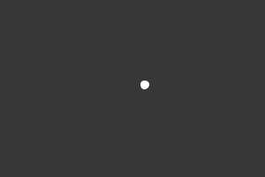
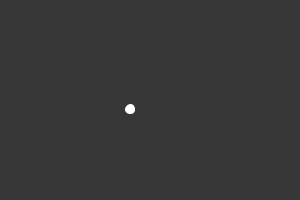
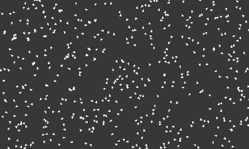
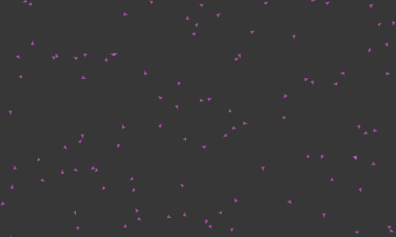
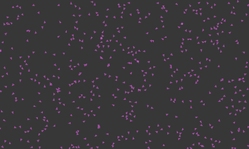
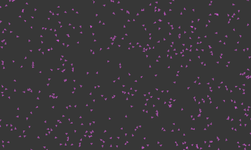
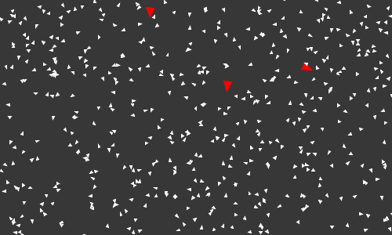
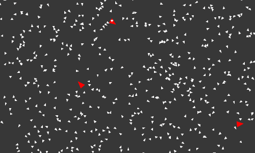

<h1 style="text-align: center">Building Particle Systems to Simulate Flocking Behaviors</h1>
<div style="text-align: center">Aaron George</div>

<div style="page-break-after: always; break-after: page;"></div>

___

_Abstract_. Particle systems have primarily been used for the procedural generation of natural phenomena in movies, digital animation, and video games. This discussion provides an introduction to particle systems and walks through the implementation of a simple particle system. The implemented system is used to simulate flocking behaviors in nature and demonstrate the applications of the flocking algorithm in digital art and design.

---


# Introduction

## 1.1 Background

Particle systems originated in 1982 as a solution for simulating phenomena like clouds, smoke, water, fire, and other *fuzzy* objects that could not be graphically modeled through the technology of the time (Reeves, 1983). Reeves, an animator at Lucasfilm Ltd., used the word *fuzzy* to describe objects that have dynamic and fluid structures. In other words, these objects are not rigid and their surface and shape is not always well defined. While working on the movie *Star Trek II: The Wrath of Khan*, Reeves described a technique that enables the procedural generation of fuzzy objects. Specifically, a scene in the movie required a wall of fire that ripples over a planet (Shiffman, 2012). To achieve the desired graphic, particle systems were implemented and used to imitate the features of fire.

The applications of particle systems are not confined to movies - they have been used in several settings like video games and digital animation to generate realistic simulations of natural phenomena. This discussion focuses on building and using a particle system to simulate flocking behaviors in organisms. This specifically pertains to birds, fish, and bees - species that are known to exhibit specific behaviors while traveling in groups. 


## 1.2 Processing

This discussion utilizes *Processing*, a community driven tool that can be used to teach the fundamentals of programming using Java in a visual context.

>  Processing is a flexible software sketchbook and a language for learning how to code within the context of the visual arts. Since 2001, Processing has promoted software literacy within the visual arts and visual literacy within technology. There are tens of thousands of students, artists, designers, researchers, and hobbyists who use Processing for learning and prototyping.
>
> *— The Processing Foundation*

Keeping with the language of the visual arts, individual projects in Processing are typically referred to as *sketches*. Rendering of visuals occurs within a `draw` function. Accordingly the basic structure of a Processing sketch looks like this:

```java
void setup() {
    // called once at the beginning
}

void draw() {
    // called once every frame
}
```

Notice that a `setup` function is also included. This function is executed one time, before the sketch is rendered, and is typically used for initial tasks such as setting the canvas size, background color, specifying the renderer, initializing variables, and variable assignment. The `draw` function contains the code that is executed during each frame of the sketch and is typically used to draw images or visuals on the canvas. More details about Processing, the Processing Foundation, and the Processing Community can be found [here](https://processing.org/).


## 1.3 Vectors

An important construct used throughout this project is a *vector*. Simply stated, a vector is an entity that has both magnitude and direction (Shiffman, 2012). The magnitude of a vector determines its length, while the direction determines which way the vector is pointing. The idea of a vector is integral to this discussion because it has mathematical properties that can be utilized to transform points in Euclidean space to give the illusion of motion. Thankfully, Processing contains several structures and methods that allow the mathematical manipulation of vectors in two and three dimensions.


# Particles

## 2.1 Properties of Particles

Reeves (1983)  delineates three ways in which objects created with particle systems differ from objects created using traditional techniques. 

1. *Structure.* With particles systems, objects are not generated as a synthesis of well-defined shapes that define the object's boundary. Instead, they are generated as *clouds* of primitive particles that define the object's volume.
2. *Lifetime.* Particle systems are not static. They comprise of individual particles that are created and destroyed as necessary.
3. *Shape.* Objects created with particle systems are not deterministic. This means that their shape and form are not completely defined. Instead, the shape and form is created and shaped through other pseudo random algorithmic techniques.

Note that the number of particles in the system determines the density of an object - greater density is achieved by increasing the number of particles. Unsurprisingly, at the core of a particle system is the individual particle - an entity that possesses several attributes.

Reeves describe seven properties that characterize a particle. Accordingly, a particle has a (1) position, (2) velocity, (3) size, (4) color, (5) transparency, (6) shape, and (7) lifetime. On creation of a new particle, an initial value must be determined for each of these properties. These properties control the structure, shape, density, and form of a particle system. The initial properties for each particle can be manipulated to enhance the dynamic qualities of the object.


## 2.2 Implementing the Particle System

The previous section discussed the characteristics of a particle. In this section, we will attempt to implement a particle object and render it through a Processing sketch.

First, we define the `Particle` class that will be the basis for all future sketches in this discussion.

```java
class Particle {
    PVector position, velocity, acceleration;
    float mass, size, speed, r, g, b;

    public Particle(float x, float y, float mass_, float size_, float speed_, float r_, float g_, float b_) {
        position = new PVector(x, y);
        velocity = PVector.random2D();
        acceleration = new PVector();
        mass = mass_;
        size = size_;
        speed = speed_;
        r = r_;
    	g = g_;
    	b = b_;
    }
}
```

Observe that not all of the properties described in the previous section are being defined. We only specify the attributes that are relevant to this discussion. The constructor allows the particle to be initialized with a specified position, mass, size, and maximum speed. The velocity of each particle is set to a random unit vector by default. Next, we can implement a method that renders the particle in our sketch.

```java
class Particle {
	/* ... */

    public void render() {
        push();
        stroke(r, g, b);
        fill(r, g, b);
        ellipse(position.x, position.y, size, size);
        pop();
    }
}
```

Finally, we implement the methods that simulate the *physics* of the particle. Note that these are all members of the `Particle` class, but will be discussed separately for clarity.

The `applyForce` method, quite simply, applies a specified force to the particle. Using Newton's Laws of Motion, we know that $F = m * a$, where $F$ is the force, $m$ is the mass of the object, and $a$ is the acceleration. From this equation, we have $a = F / m$. Accordingly, this method divides the given force by the mass of the particle, and adds it to the acceleration of the particle. This has been implemented in a way that allows several forces to be simultaneously applied to the particle. The acceleration of the particle can then be used to update its position.

```java
public void applyForce(PVector force) {
    this.acceleration.add(force.div(mass));
}
```

The `update` method manipulates the position of the particle. We begin by adding the current acceleration to the velocity, and subsequently adding the velocity to the current position. Note that  `velocity` stores the current direction of motion for a particle. This process  shifts the particle's position through each frame, giving the illusion that the particle is moving based on the amount of force applied to it.

```java
public void update() {
    velocity.add(acceleration);
    position.add(velocity);
    velocity.limit(speed);
    acceleration.mult(0);
}
```

The following methods allow a certain degree of control over the particle. `wrapEdges` allows a particle to move freely on the canvas by making it seems as though the edges are connected to each other. `repelEdges` changes the velocity of a particle to the opposite direction as soon as it touches an edge. `constrain` is a similar method that restricts the particle's movement to specified limits.

```java
public void wrapEdges() {
    if (position.x < 0) position.x = width;
    if (position.x > width) position.x = 0;
    if (position.y < 0) position.y = height;
    if (position.y > height) position.y = 0;
}

public void repelEdges() {
    if (this.position.x <= 0 || this.position.x >= width) this.velocity.x *= -1;
    if (this.position.y <= 0 || this.position.y >= height) this.velocity.y *= -1;
}

public void constrain(float u, float d, float l, float r) {
    if (this.position.x <= l || this.position.x >= r) this.velocity.x *= -4;
    if (this.position.y <= u || this.position.y >= d) this.velocity.y *= -4;
}
```

Finally, we can set up our sketch to witness a particle in action. 

```java
Particle p;

void setup() {
  size(300, 200);
  p = new Particle(width/2, height/2, 1, 5, 4, 255, 255, 255);
}

void draw() {
  background(55);
  p.applyForce(new PVector(0, 0.2)); 
  p.update();
  p.wrapEdges();
  p.render();
}
```

By replacing `line 14` with   `p.repelEdges();` and `p.constrain(50, 150, 100, 200);` respectively, we receive the following sketches.

<div style="text-align: center;">
    <div style="display: inline-block;">
        
        <div>
            Particle Wrapping Edges
        </div>
    </div>
    <div style="display: inline-block;">
        
        <div>
            Particle Repelling Edges
        </div>
    </div>
    <div style="display: inline-block;">
        
        <div>
            Constrained Particle
        </div>
    </div>
</div>

We now have a basic Particle object that we can extend to implement the flocking algorithm.


# Flocking

## 3.1 Boids

Several organisms tend to follow specific patterns when traveling in groups. In general, and at the most basic level, these patterns appear to be bound by three simple rules. These rules describe the *steering* behaviors of organisms that represent their ability to navigate around their world in a lifelike and improvisational manner. Reynolds used the word *boids* to describe the generic (simulated) flocking creatures used to demonstrate these rules  (Reynolds, 1987).

1. *Separation.* Steering to avoid crowding *local* flockmates.
2. *Alignment.* Steering towards the average heading of *local* flockmates.
3. *Cohesion.* Steering to move towards the average position of *local* flockmates.

Applying all three rules to a group of boids must theoretically result in simulated flocking behavior. Observe that all three rules are applied relative to *local* flockmates. This is an important detail that implies that a radius of perception exists for each boid. Thus, each rule must be implemented in relation to neighboring boids, rather than all boids on the canvas.


## 3.2 Implementing the Flocking Algorithm

Based on the description of a boid, we notice that it can be implemented as an extension of the existing `Particle` class.

```java
public class Boid extends Particle {
    float perceptionRadius;

	public Boid(float x, float y, float size, float r, float g, float b) {
		super(x, y, 1, size, 2, r, g, b);
		perceptionRadius = 60;
	}
}
```

We introduce an additional attribute `perceptionRadius` to specify a boid's area of perception. This is set to a default value of 60 (in this case, pixels). Next, we override the `render` method of the `Particle` class.

```java
public void render() {
    push();
    stroke(255);
    fill(255);
    translate(this.position.x, this.position.y);
    rotate(this.velocity.heading() - radians(90));
    triangle(0, 0, this.size, 0, this.size / 2, this.size * 1.2);
    pop();
}
```

This renders each boid as a triangle that points in the direction of its current heading. Let's create a sketch to render `500` boids on the canvas. We will make use of the existing `update` method to simulate motion in the boids. 

```java
ArrayList<Boid> boids = new ArrayList<Boid> ();

void setup() {
	size(500, 300);

	for (int i = 0; i<500; i++) {
		boids.add(new Boid(random(width), random(height), 3, 255, 100, 255));
	}
}

void draw() {
	background(55);

	for (Boid b: boids) {
		b.update();
		b.wrapEdges();
		b.render();
	}
}
```

<div style="text-align: center;">
    
</div>

We now see our boids on the canvas, but they all seem to be moving randomly. In preparation for implementing the flocking algorithm, we implement a method to find all neighboring boids that are within the perception radius of each boid.

```java
public ArrayList<Boid> nearestNeighbors(ArrayList<Boid> boids) {
    ArrayList<Boid> neighbors = new ArrayList<Boid> ();

    for (Boid boid: boids) {
        float distance = position.dist(boid.position);
        if (boid != this && distance<perceptionRadius) {
            neighbors.add(boid);
        }
    }

    return neighbors;
}
```

We are now ready to implement the flocking rules.


### 3.2.1 Separation

Separation involves steering to avoid crowding local flockmates. This means that if a boid approaches the position of one of its neighbors, it must steer away from that position. This ensures that all boids do not end up at the same location and remain *separate*. We achieve this behavior by subtracting the neighboring boid's position from the current boid. This results in a vector in the opposite direction from the neighboring boid and can be considered as the repellent force. We can calculate the cumulative force for each neighboring boid and divide by the total number of neighbors to find the average repellent force. Finally, we add the repellent force to the acceleration of the current boid.

```java
private void separation(ArrayList<Boid> nearby) {
    PVector steeringForce = new PVector();

    for (Boid boid: nearby) {
        float distance = position.dist(boid.position);
        PVector repellentForce = PVector.sub(position, boid.position);
        repellentForce.div(distance);
        steeringForce.add(repellentForce);
    }

    if (nearby.size() > 0) {
        steeringForce.div(nearby.size());
        steeringForce.setMag(4);
        steeringForce.sub(this.velocity);
        steeringForce.limit(0.3);
    }

    this.acceleration.add(steeringForce);
}
```

Let's create a utility method called `flock` to help execute this method. 

```java
public void flock(ArrayList<Boid> boids) {
    ArrayList<Boid> neighbors = this.nearestNeighbors(boids);
    this.separation(neighbors);
}
```

Now, we can update our sketch to utilize the separation behavior by inserting `b.flock(boids)` on `line 15`. The resulting separation behavior is demonstrated below.

<div style="text-align: center;">
    
</div>

Observe how each boid swerves away from neighboring boids. We have, thus, achieved the desired separation behavior.


### 3.2.2 Alignment

Alignment involves steering towards the average heading of local flockmates. This implementation is similar to separation. We calculate the steering force by finding the average velocity of each neighboring boid. Applying this to the acceleration of the current boid should result in the alignment behavior. Note that on `line 11` we subtract the current boid's velocity from the steering force. We do this based on Reynold's formula for steering, which states that it is the difference between the desired velocity and the current velocity.

```java
private void alignment(ArrayList<Boid> boids) {
    PVector steeringForce = new PVector();

    for (Boid boid: boids) {
        steeringForce.add(boid.velocity);
    }

    if (boids.size() > 0) {
        steeringForce.div(boids.size());
        steeringForce.setMag(4);
        steeringForce.sub(this.velocity);
        steeringForce.limit(0.2);
    }

    this.acceleration.add(steeringForce);
}
```

Now, we update the `flock` method to execute only the alignment behavior.

```java
public void flock(ArrayList<Boid> boids) {
    ArrayList<Boid> neighbors = this.nearestNeighbors(boids);
    this.alignment(neighbors);
}
```

<div style="text-align: center;">
    
</div>

We clearly see that each boid gradually steers towards the general direction of neighboring boids. Thus, the alignment behavior has been achieved.


### 3.2.3 Cohesion

Cohesion involves steering to move towards the average position of local flockmates. This is similar to the alignment implementation. The only difference is that we calculate the average position of each neighboring boid instead of the average velocity.

```java
private void cohesion(ArrayList<Boid> boids) {
    PVector steeringForce = new PVector();

    for (Boid boid: boids) {
        steeringForce.add(boid.position);
    }

    if (boids.size() > 0) {
        steeringForce.div(boids.size());
        steeringForce.sub(this.position);
        steeringForce.setMag(4.5);
        steeringForce.sub(this.velocity);
        steeringForce.limit(0.2);
    }

    this.acceleration.add(steeringForce);
}
```

Now, we update the `flock` method to execute only the cohesion behavior.

```java
public void flock(ArrayList<Boid> boids) {
    ArrayList<Boid> neighbors = this.nearestNeighbors(boids);
    this.cohesion(neighbors);
}
```

<div style="text-align: center;">
    
</div>

We clearly see that each boid gradually converges on the general position of neighboring boids. Thus, the cohesion behavior has been achieved.


### 3.2.4 Putting it all Together

We have observed each rule's individual affect on our particles system (boids). We can now modify our code to execute all three rules on each boid. The only change we need to make to achieve this is in the `flock` method.

```java
public void flock(ArrayList<Boid> boids) {
    ArrayList<Boid> neighbors = this.nearestNeighbors(boids);
    this.separation(neighbors);
    this.alignment(neighbors);
    this.cohesion(neighbors);
}
```

Running our sketch now displays the desired flocking behavior.

<div style="text-align: center;">
    
</div>


# Applying the Flocking Algorithm

## 4.1 Avoiding Predators

The general flocking behavior of boids, while impressive, only provides a basic simulation of flocking behavior. We continue this discussion by introducing a new element onto the canvas - a predator. Let's begin by implementing a `Predator` class as an extension of `Boid`. It will be rendered on the canvas a larger red triangle.

```java
class Predator extends Boid {
	public Predator(float x, float y) {
		super(x, y, 10, 255, 0, 0);
	}
}
```

<div style="text-align: center;">
    
</div>

The flocking behavior continues, but none of the boids seem to react to the predators. We can implement another method in the `Boid` class to enable avoidance of predators.

```java
private void avoid(ArrayList<Predator> predators) {
    for (Predator predator: predators) {
        float distance = position.dist(predator.position);

        if (distance < 40) {
            PVector steeringForce = new PVector();
            PVector repellentForce = PVector.sub(position, predator.position);
            steeringForce.add(repellentForce);
            steeringForce.sub(this.velocity);
            steeringForce.limit(1);

            this.acceleration.add(steeringForce);
        }
    }
}
```


<div style="text-align: center;">
    
</div>
We now observe additional avoidance of predators along with flocking behaviors. This demonstrates how additional behaviors can be implemented to generate higher order flocking behavior.


## 4.2 Multiple Systems

The power of particle systems becomes more apparent when we simultaneously implement several of them. We do this by adding as many array lists of particles as needed. Since the code for the sketch remains the same, we will only display the resulting sketches.

<div style="text-align: center;">
    
</div>

In the sketch above, the two systems are colored differently, but we clearly notice that they flow in their own respective directions. What would this behavior look like if we introduced the predators?

<div style="text-align: center;">
    
</div>

We notice that the two systems avoid the predators as expected, but continue to maintain their respective directions. Finally, as an experiment, we force the second system to flock with boids in the first system. This starts to display some dense, fluid-like motions that may be useful in other projects.

<div style="text-align: center;">
    
</div>


## 4.3 Rorschach

As a final demonstration, we use all the code that has been implemented so far to generate a more aesthetic and artistic piece. The goal is to procedurally generate Rorschach inspired patterns that are constantly shifting and moving. We will do this by creating a boid that implements only one behavior - attracting other boids. 

```java
class Attractor extends Boid {
	public Attractor(float x, float y) {
		super(x, y, 10, 255, 255, 255);
		this.velocity.setMag(10);
	}

	public void attract(ArrayList<Boid> boids) {
		ArrayList<Boid> neighbors = nearestNeighbors(boids);

		for (Boid b: neighbors) {
			b.applyForce(PVector.sub(this.position, b.position).limit(0.4));
		}
	}
}
```

Next, we will create a sketch that overrides the render method for all regular boids to draw an ellipse instead of a triangle with a higher stroke weight and greater opacity. We will also reflect each boid on the opposite side of the canvas to achieve symmetric patterns. We also modify the `avoid` method in the `Boid` class to enable avoidance of attractors. Finally, we  increase the number of boids in the system and constrain them to a small box. This increases the density of the generated visuals because there are numerous boids enclosed in a small space.

```java
ArrayList<Boid> boids = new ArrayList<Boid> ();
ArrayList<Attractor> attractors = new ArrayList<Attractor> ();

float constrainLimit = 50;

void setup() {
	size(400, 200);

	for (int i = 0; i < 4; i++) {
		attractors.add(new Attractor(0, 0));
	}

	for (int i = 0; i < 1000; i++) {
		boids.add(new Boid(random(-4, 4), random(-6, -4), 4));
	}
}

void draw() {
	background(255);

	translate(width / 2, height / 2);

	for (Attractor a: attractors) {
		a.update();
        a.constrain(-constrainLimit, constrainLimit, -constrainLimit, constrainLimit);
		a.attract(boids);
	}

	for (Boid b: boids) {
		b.flock(boids);
		b.avoid(attractors);
		b.update();
		b.constrainRepell(-constrainLimit, constrainLimit, -constrainLimit, constrainLimit);

		stroke(55, 30);
		strokeWeight(6);
		point(b.position.x, b.position.y);
		point(b.position.x + (2 * (-b.position.x)), b.position.y);
	}
}
```

<div style="text-align: center;">
    
</div>

We notice that the boids steer toward the attractors, which are constantly moving. This causes a dynamic and fluid motion in the boids. If we invert the colors and hide the attractors, these are the final results.

<div style="text-align: center;">
    
    
    
    
</div>

To achieve the last design, we used three systems with varying colors and a larger number of boids.


# Conclusion

The goal of this discussion was to introduce particle systems as a way to simulate flocking behaviors in organisms. We observed the similarities between the *boid*, as described by Reynolds (1987), and particles, as described by Reeves (1983). In light of the similarities, we were able to generalize the implementation of a Particle to the implementation of a boid. Using the basic rules that bind steering behaviors, we simulated flocking and avoidance behaviors in groups of organisms, and utilized these implementations to generate dynamic and fluid animations. We have thus demonstrated the application of particle systems beyond movie and video game graphics. Furthermore, we have displayed creative ways to use the flocking algorithm for artistic pieces.


# References

Reeves, W. T. (1983). Particle systems---a technique for modeling a class of fuzzy objects. *ACM SIGGRAPH Computer Graphics*, *17*(3), 359–375. doi: 10.1145/964967.801167

Reynolds, C. W. (1987). Flocks, herds and schools: A distributed behavioral model. *ACM SIGGRAPH Computer Graphics*, *21*(4), 25–34. doi: 10.1145/37402.37406

Shiffman, D. (2012). *The nature of code*. Erscheinungsort nicht ermittelbar: Selbstverl.